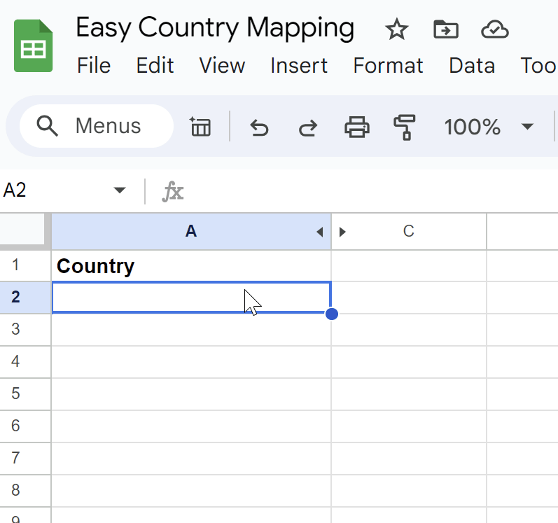

# Simple Country Mapper

Make simple country maps quickly using Google Sheets and My Maps 

## Quick start guide

1. Clone the [example spreadsheet](https://docs.google.com/spreadsheets/d/1-xHMfclGL_E_Hwnmp_y8Kb8CXG3viHRFA9rZ_G3Oaj4/copy)
2. Fill in the first (Country) column with your countries
3. Go to [Google My Maps](https://www.google.com/mymaps) and create a new map
4. On a new layer, select Import -> Google Drive -> Navigate to the spreadsheet you copied
5. Select "WKT" for your Placemarks, and "Country" to title your markers

## Quick start gif

### Create the spreadsheet

### Import it into My Maps

NB: Your data has to be the first sheet in the spreadsheet. There's no option to select a sheet.

## FAQ

### How does this work?
Google Sheets [supports WKT format](https://support.google.com/mymaps/answer/3024836?hl=en&co=GENIE.Platform%3DDesktop&oco=1#zippy=%2Cstep-prepare-your-info)
for displaying polygons. For convenience, I created a sheet called AllCountries, which has a list of countries and their corresponding WKT

The first sheet just does a VLOOKUP and puts the data into a hidden column called "WKT". It has to be called exactly that for some reason 🤷 

### The borders are wrong!
The borders are derived from here [world-administrative-boundaries.geojson is from here](https://datahub.io/core/geo-countries#countries)
Google Sheets only supports 50,000 characters in a cell, so larger countries are lower resolution.

## Why not just use <webapp / GIS / my favourite mapping library>
It seems to me that maps are simple, reproducible and accurate, choose 2:
- There are a few simple webapps for this, but it's usually not easy to import from an easily editable file
- GIS tools are accurate and reproducible, but too complex for personal use
This aims to be simple and reproducible, but I don't care about things like borders being exactly right

## I get an error "1 row couldn't be shown on the map"
You're probably using the wrong country name, click the "open data table" button to see what one(s) are wrong.
They are highlighted in red. Then look for the name in the AllCountries sheet (or 
[country-wkt.csv](output/country-wkt.csv).) 
Either use the name in there, or change it in AllCountries if you prefer another name.

## Why did you remap some of the country names from the ISO 3166-2 names?
Because this is designed to be simple. There may be a better source of short names, but this was a quick 
remapping to be closer to their Wikipedia names (generated using ChatGPT)
If you don't like it, you can change the mappings and regenerate the output file yourself

## How can I customise this?
Clone the repo and use a different [.geojson file](input/world-administrative-boundaries.geojson) 
if you want to use different areas, or edit [the mapping file](input/simpler_countries.json) to use different names
Then go into the AllCountries tab on Google Sheets and reimport:
- Import
- Upload (select your new output/country-wkt.csv file)
- Import location: replace current sheet and press Import data

## Your code is bad!
Probably! This was a relatively quick and dirty attempt to tidy up and open source an even hackier version 
that I've been using for a while. 
Open am issue or Pull Request!

